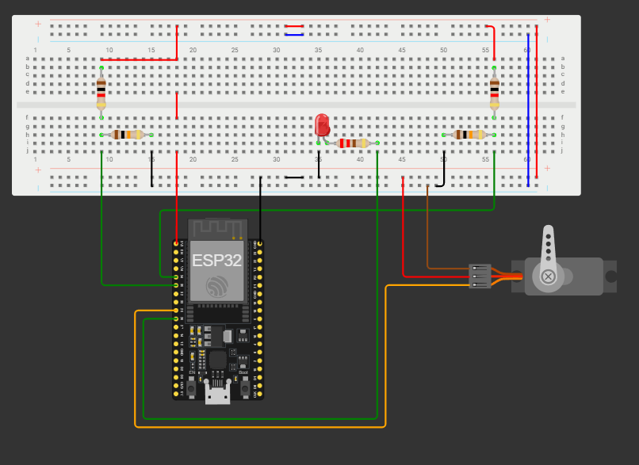

# PUNTO 4: Rastreador de luz con dos LDRs y servomotor en ESP32

##  Descripción

Este proyecto implementa un **sistema de seguimiento de luz (light tracker)** usando un **ESP32 DevKit**, dos **LDRs** y un **servo de 90°**.  
El sistema detecta la dirección de una fuente de luz y **orienta el servo** hacia ella.  
Además, un **LED indicador** se enciende cuando la luz supera un umbral de intensidad.

---

##  Componentes

| Componente | Cantidad | Descripción |
|-------------|-----------|-------------|
| ESP32 DevKit | 1 | Microcontrolador principal |
| LDR (fotorresistencia) | 2 | Detectores de luz |
| Resistencia fija 10 kΩ | 2 | Forman divisores de tensión con los LDR |
| Servo motor 180° o 90° | 1 | Actuador de orientación |
| LED (Opcional) | 1 | Indicador visual de luz intensa |
| Resistencia 220 Ω | 1 | Limitadora de corriente para el LED |
| Cables y protoboard | - | Conexiones |

---

##  Conexión de hardware

### Divisor de tensión para cada LDR

Cada LDR se conecta en serie con una resistencia fija de 10 kΩ formando un divisor:

```
(Vcc = 3.3V)
         LDR1           LDR2
          │               │
         ┌┴┐             ┌┴┐
         │ │             │ │
         │ │             │ │
         └┬┘             └┬┘
          │               │
          ├── GPIO32      ├── GPIO33
          [10kΩ]          [10kΩ]
          │               │
         GND             GND

Servo (PWM) → GPIO26 o pin a eleccion 
LED (con 220Ω) → GPIO25 o pin a eleccion 
```
### Esquematico completo

1. Considere las rresistencias de 1kΩ como los LDR (fotoresistencias).
2. Recuerde que puede modificar los pines a conveniencia.


---

## Principio de funcionamiento

1. Cada LDR mide la intensidad de luz y genera un voltaje proporcional.
2. El ESP32 lee ambos valores analógicos (0–4095) y calcula su diferencia.
3. Si el **LDR izquierdo** recibe más luz → el servo gira hacia la izquierda.  
   Si el **LDR derecho** recibe más luz → el servo gira hacia la derecha.
4. El **LED** se enciende cuando cualquiera de los dos sensores supera un umbral de luminosidad.
5. El sistema busca **mantener balanceadas las lecturas**, orientando el servo hacia el foco de luz.

---

##  Código fuente (Arduino)

```cpp
#include <ESP32Servo.h>

const int ldrIzq = 35;   // ADC1_CH0 - PIN ADC LDR izquierda (usar segun conveniencia)
const int ldrDer = 34;   // ADC1_CH3 - PIN ADC LDR derecha (usar segun conveniencia)
const int pinServo = 25; // PWM
const int ledAlarma = 26; // LED opcional

Servo servo;

// Variables de calibración
float Rfija = 10000.0; // 10kΩ resistencia fisica con el que se hace divisor de tension
float Ksensibilidad = 0.8; // Ajusta la respuesta al contraste de luz
int angulo = 90; // posición inicial centrada

void setup() {
  Serial.begin(115200);
  servo.attach(pinServo);
  pinMode(ledAlarma, OUTPUT);
  digitalWrite(ledAlarma, LOW);
  servo.write(angulo);
  delay(1000);
  Serial.println("Sistema de seguimiento de luz iniciado");
}

void loop() {
  // Lecturas analógicas
  int vIzq = analogRead(ldrIzq);
  int vDer = analogRead(ldrDer);

  // Conversión a voltaje
  float VadcIzq = (vIzq / 4095.0) * 3.3;
  float VadcDer = (vDer / 4095.0) * 3.3;

  // Calcular resistencia de cada LDR
  float RldrIzq = (3.3 * Rfija / VadcIzq) - Rfija;
  float RldrDer = (3.3 * Rfija / VadcDer) - Rfija;

  // Diferencia relativa (negativo: más luz en derecha, positivo: más en izquierda)
  float diff = (RldrDer - RldrIzq) / Rfija;

  // Control proporcional simple
  angulo = angulo + diff * 20 * Ksensibilidad;

  // Limitar ángulo entre 0 y 90 grados
  angulo = constrain(angulo, 0, 90);
  servo.write(angulo);

  // Alarma si hay mucha diferencia
  if (fabs(diff) > 0.5)
    digitalWrite(ledAlarma, HIGH);
  else
    digitalWrite(ledAlarma, LOW);

  // Impresiones
  Serial.print("LDR Izq (RΩ): "); Serial.print(RldrIzq, 0);
  Serial.print(" | LDR Der (RΩ): "); Serial.print(RldrDer, 0);
  Serial.print(" | Diff: "); Serial.print(diff, 2);
  Serial.print(" | Servo: "); Serial.println(angulo);

  delay(300);
}

```

---

##  Calibración

- Ajusta `THRESHOLD` según la iluminación ambiental.   
- El rango del `map()` puede modificarse para controlar la **velocidad de reacción** del servo.

---

##  Ejemplo de salida serial

```
LDR Izq (RΩ): 1764 | LDR Der (RΩ): 0 | Diff: -0.18 | Servo: 0
LDR Izq (RΩ): 1928 | LDR Der (RΩ): 220 | Diff: -0.17 | Servo: 0
LDR Izq (RΩ): 1949 | LDR Der (RΩ): 159 | Diff: -0.18 | Servo: 0
```

---


## 👨‍💻 Autor
**Juan Esteban**  
Proyecto de sistemas embebidos para el curso de instrumentacion electronica: seguimiento de luz con ESP32, dos LDRs y un servomotor.

