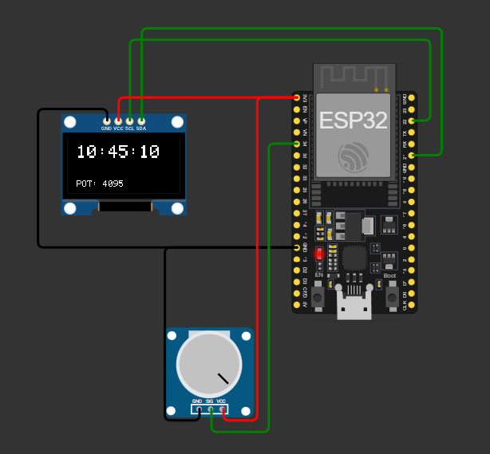

 # PUNTO 2 I2C: Visualización de reloj digital y lectura de potenciómetro en pantalla OLED SSD1306 

 ## Descripción general 

 En este proyecto se implementa un **reloj digital** que muestra la hora junto con el valor leído desde un **potenciómetro analógico**. 
 Ambos datos se visualizan simultáneamente en una **pantalla OLED I2C SSD1306** 
 --- 

 ## Componentes requeridos 

 | Componente | Cantidad | Descripción | 
 |-------------|-----------|-------------| 
 | ESP32 DevKit | 1 | Microcontrolador principal |
 | Pantalla OLED SSD1306 | 1 | Comunicación por I2C (0x3C) |
 | Potenciómetro | 1 | Control analógico de entrada |
 | Cable USB | 1 | Programación y monitor serial |
 | PC con Arduino IDE | 1 | Entorno de programación y monitoreo |

 --- 

 ## Esquema de conexión 

 ### Pantalla OLED SSD1306 
 | OLED Pin | ESP32 Pin sugerido | 
 |-----------|-------------------| 
 | VCC | 3.3V |
 | GND | GND |
 | SDA | GPIO 21 |
 | SCL | GPIO 22 | 

 ### Potenciómetro 
 | Pin Potenciómetro | ESP32 | 
 |-------------------|--------| 
 | Terminal izquierda | 3.3V |
 | Terminal derecha | GND |
 | Terminal central (cursor) | GPIO 34 | 




 --- 

 ## Lógica del programa 

 1. Inicializa la pantalla OLED y la comunicación serial. 
 2. Lee continuamente el valor del potenciómetro (0 a 4095). 
 3. Actualiza el reloj cada segundo, incrementando segundos, minutos y horas. 
 4. Muestra en pantalla la hora y el valor analógico. 
 5. Envía los mismos datos por el monitor serial para depuración. 

 --- 

 ## Código del proyecto 

 ```cpp 
 #include <Wire.h> 
 #include <Adafruit_GFX.h> 
 #include <Adafruit_SSD1306.h> 

 #define ANCHO 128 
 #define ALTO 64 
 #define OLED_RESET -1 
 Adafruit_SSD1306 display(ANCHO, ALTO, &Wire, OLED_RESET); 

 int potPin = 34; 
 int hora = 10; 
 int minuto = 45; 
 int segundo = 0; 
 unsigned long previo = 0; 
 unsigned long intervalo = 1000; 

 void setup() { 
   Serial.begin(115200); 
   if (!display.begin(SSD1306_SWITCHCAPVCC, 0x3C)) { 
     Serial.println("No se detecta pantalla SSD1306"); 
     for (;;); 
   } 
   display.clearDisplay(); 
   display.display(); 
   Serial.println("Iniciando reloj digital con lectura de potenciómetro..."); 
 } 

 void loop() { 
   int valor = analogRead(potPin); 
   unsigned long actual = millis(); 

   if (actual - previo >= intervalo) { 
     previo = actual; 
     segundo++; 
     if (segundo >= 60) { 
       segundo = 0; 
       minuto++; 
       if (minuto >= 60) { 
         minuto = 0; 
         hora++; 
         if (hora >= 24) hora = 0; 
       } 
     } 

     Serial.print("Hora actual: "); 
     if (hora < 10) Serial.print("0"); 
     Serial.print(hora); 
     Serial.print(":"); 
     if (minuto < 10) Serial.print("0"); 
     Serial.print(minuto); 
     Serial.print(":"); 
     if (segundo < 10) Serial.print("0"); 
     Serial.print(segundo); 
     Serial.print(" | Potenciometro: "); 
     Serial.println(valor); 
   } 

   display.clearDisplay(); 
   display.setTextSize(2); 
   display.setTextColor(SSD1306_WHITE); 
   display.setCursor(10, 10); 
   if (hora < 10) display.print("0"); 
   display.print(hora); 
   display.print(":"); 
   if (minuto < 10) display.print("0"); 
   display.print(minuto); 
   display.print(":"); 
   if (segundo < 10) display.print("0"); 
   display.print(segundo); 

   display.setTextSize(1); 
   display.setCursor(10, 50); 
   display.print("POT: "); 
   display.print(valor); 
   display.display(); 

   delay(100); 
 } 
 ``` 

 --- 

 ## Ajustes y recomendaciones 

 - La dirección I2C de la pantalla puede ser `0x3C` o `0x3D`, según el módulo. 
 - El potenciómetro puede conectarse a cualquier pin **ADC** válido, actualizando `potPin`. 
 - Se puede usar el valor del potenciómetro para ajustar la **velocidad del reloj** o el **brillo**. 

 --- 

 ## Resultados esperados 

 En el monitor serial se observa algo como: 
 ``` 
 Hora actual: 10:45:01 | Potenciometro: 1324 
 Hora actual: 10:45:02 | Potenciometro: 1308 
 Hora actual: 10:45:03 | Potenciometro: 1299 
 ``` 

 Y en la pantalla OLED: 
 10:45:03 
 POT: 1299 

 --- 

 ## 👨‍💻 Autor 

 **Juan Esteban**   
 Proyecto de práctica con **I2C y entradas analógicas** usando **ESP32 + OLED SSD1306**,   
 desarrollado para el curso de **Instrumentación Electrónica / Sistemas Embebidos**. 
